# Data Vault ER Diagram — Pinnacle Financial Services Analytics

Derived from the star schema in `GB_RAUTHG_DB.ANALYTICS`. Follows Data Vault 2.0 methodology with hash keys, load timestamps, and record source tracking.

```mermaid
erDiagram

    HUB_CLIENT {
        BINARY CLIENT_HK PK
        VARCHAR CLIENT_ID
        TIMESTAMP LOAD_DTS
        VARCHAR REC_SRC
    }

    HUB_PRODUCT {
        BINARY PRODUCT_HK PK
        VARCHAR PRODUCT_ID
        TIMESTAMP LOAD_DTS
        VARCHAR REC_SRC
    }

    HUB_GL_ACCOUNT {
        BINARY GL_ACCOUNT_HK PK
        VARCHAR GL_ACCOUNT_ID
        TIMESTAMP LOAD_DTS
        VARCHAR REC_SRC
    }

    HUB_DEPARTMENT {
        BINARY DEPARTMENT_HK PK
        VARCHAR DEPARTMENT_ID
        TIMESTAMP LOAD_DTS
        VARCHAR REC_SRC
    }

    HUB_DATE {
        BINARY DATE_HK PK
        DATE DATE_KEY
        TIMESTAMP LOAD_DTS
        VARCHAR REC_SRC
    }

    LNK_REVENUE {
        BINARY REVENUE_HK PK
        BINARY CLIENT_HK FK
        BINARY PRODUCT_HK FK
        BINARY GL_ACCOUNT_HK FK
        BINARY DATE_HK FK
        TIMESTAMP LOAD_DTS
        VARCHAR REC_SRC
    }

    LNK_EXPENSE {
        BINARY EXPENSE_HK PK
        BINARY DEPARTMENT_HK FK
        BINARY GL_ACCOUNT_HK FK
        BINARY DATE_HK FK
        TIMESTAMP LOAD_DTS
        VARCHAR REC_SRC
    }

    LNK_BUDGET {
        BINARY BUDGET_HK PK
        BINARY DEPARTMENT_HK FK
        BINARY GL_ACCOUNT_HK FK
        BINARY DATE_HK FK
        TIMESTAMP LOAD_DTS
        VARCHAR REC_SRC
    }

    SAT_CLIENT {
        BINARY CLIENT_HK FK
        TIMESTAMP LOAD_DTS
        VARCHAR REC_SRC
        BINARY HASH_DIFF
        VARCHAR CLIENT_NAME
        VARCHAR CLIENT_SEGMENT
        DATE RELATIONSHIP_START
        VARCHAR RELATIONSHIP_MANAGER
        VARCHAR OFFICE_LOCATION
        VARCHAR AUM_TIER
        VARCHAR STATUS
    }

    SAT_PRODUCT {
        BINARY PRODUCT_HK FK
        TIMESTAMP LOAD_DTS
        VARCHAR REC_SRC
        BINARY HASH_DIFF
        VARCHAR PRODUCT_NAME
        VARCHAR PRODUCT_CATEGORY
        VARCHAR FEE_TYPE
        NUMBER FEE_RATE_BPS
        DATE INCEPTION_DATE
        VARCHAR STATUS
    }

    SAT_GL_ACCOUNT {
        BINARY GL_ACCOUNT_HK FK
        TIMESTAMP LOAD_DTS
        VARCHAR REC_SRC
        BINARY HASH_DIFF
        VARCHAR GL_ACCOUNT_NAME
        VARCHAR ACCOUNT_TYPE
        VARCHAR ACCOUNT_CATEGORY
        VARCHAR ACCOUNT_SUBCATEGORY
        BOOLEAN IS_REVENUE
        BOOLEAN IS_EXPENSE
        VARCHAR FINANCIAL_STATEMENT
    }

    SAT_DEPARTMENT {
        BINARY DEPARTMENT_HK FK
        TIMESTAMP LOAD_DTS
        VARCHAR REC_SRC
        BINARY HASH_DIFF
        VARCHAR DEPARTMENT_NAME
        VARCHAR COST_CENTER
        VARCHAR DEPARTMENT_HEAD
        VARCHAR PARENT_DEPARTMENT
    }

    SAT_DATE {
        BINARY DATE_HK FK
        TIMESTAMP LOAD_DTS
        VARCHAR REC_SRC
        BINARY HASH_DIFF
        NUMBER YEAR
        NUMBER QUARTER
        VARCHAR QUARTER_NAME
        NUMBER MONTH
        VARCHAR MONTH_NAME
        NUMBER DAY_OF_MONTH
        NUMBER DAY_OF_WEEK
        VARCHAR DAY_NAME
        BOOLEAN IS_BUSINESS_DAY
        NUMBER FISCAL_YEAR
        NUMBER FISCAL_QUARTER
    }

    SAT_REVENUE {
        BINARY REVENUE_HK FK
        TIMESTAMP LOAD_DTS
        VARCHAR REC_SRC
        BINARY HASH_DIFF
        NUMBER AUM_BALANCE
        NUMBER FEE_REVENUE
        NUMBER PERFORMANCE_FEE
        NUMBER TOTAL_REVENUE
        VARCHAR SOURCE_SYSTEM
    }

    SAT_EXPENSE {
        BINARY EXPENSE_HK FK
        TIMESTAMP LOAD_DTS
        VARCHAR REC_SRC
        BINARY HASH_DIFF
        NUMBER ACTUAL_AMOUNT
        VARCHAR VENDOR_NAME
        VARCHAR EXPENSE_DESCRIPTION
        VARCHAR SOURCE_SYSTEM
    }

    SAT_BUDGET {
        BINARY BUDGET_HK FK
        TIMESTAMP LOAD_DTS
        VARCHAR REC_SRC
        BINARY HASH_DIFF
        NUMBER BUDGET_AMOUNT
        NUMBER FORECAST_AMOUNT
        VARCHAR BUDGET_VERSION
        VARCHAR APPROVED_BY
        DATE APPROVED_DATE
    }

    %% Hub to Satellite relationships
    HUB_CLIENT ||--o{ SAT_CLIENT : "describes"
    HUB_PRODUCT ||--o{ SAT_PRODUCT : "describes"
    HUB_GL_ACCOUNT ||--o{ SAT_GL_ACCOUNT : "describes"
    HUB_DEPARTMENT ||--o{ SAT_DEPARTMENT : "describes"
    HUB_DATE ||--o{ SAT_DATE : "describes"

    %% Hub to Link relationships (Revenue)
    HUB_CLIENT ||--o{ LNK_REVENUE : "CLIENT_HK"
    HUB_PRODUCT ||--o{ LNK_REVENUE : "PRODUCT_HK"
    HUB_GL_ACCOUNT ||--o{ LNK_REVENUE : "GL_ACCOUNT_HK"
    HUB_DATE ||--o{ LNK_REVENUE : "DATE_HK"

    %% Hub to Link relationships (Expense)
    HUB_DEPARTMENT ||--o{ LNK_EXPENSE : "DEPARTMENT_HK"
    HUB_GL_ACCOUNT ||--o{ LNK_EXPENSE : "GL_ACCOUNT_HK"
    HUB_DATE ||--o{ LNK_EXPENSE : "DATE_HK"

    %% Hub to Link relationships (Budget)
    HUB_DEPARTMENT ||--o{ LNK_BUDGET : "DEPARTMENT_HK"
    HUB_GL_ACCOUNT ||--o{ LNK_BUDGET : "GL_ACCOUNT_HK"
    HUB_DATE ||--o{ LNK_BUDGET : "DATE_HK"

    %% Link to Satellite relationships
    LNK_REVENUE ||--o{ SAT_REVENUE : "measures"
    LNK_EXPENSE ||--o{ SAT_EXPENSE : "measures"
    LNK_BUDGET ||--o{ SAT_BUDGET : "measures"
```

## Data Vault Entity Summary

| Type | Count | Entities |
|------|-------|----------|
| **Hubs** | 5 | HUB_CLIENT, HUB_PRODUCT, HUB_GL_ACCOUNT, HUB_DEPARTMENT, HUB_DATE |
| **Links** | 3 | LNK_REVENUE, LNK_EXPENSE, LNK_BUDGET |
| **Satellites** | 8 | SAT_CLIENT, SAT_PRODUCT, SAT_GL_ACCOUNT, SAT_DEPARTMENT, SAT_DATE, SAT_REVENUE, SAT_EXPENSE, SAT_BUDGET |
| **Total** | **16** | |

## Star Schema to Data Vault Mapping

| Star Schema | Data Vault | Notes |
|-------------|-----------|-------|
| DIM_CLIENT | HUB_CLIENT + SAT_CLIENT | Business key → Hub; descriptive attrs → Satellite |
| DIM_PRODUCT | HUB_PRODUCT + SAT_PRODUCT | Business key → Hub; descriptive attrs → Satellite |
| DIM_GL_ACCOUNT | HUB_GL_ACCOUNT + SAT_GL_ACCOUNT | Business key → Hub; descriptive attrs → Satellite |
| DIM_DEPARTMENT | HUB_DEPARTMENT + SAT_DEPARTMENT | Business key → Hub; descriptive attrs → Satellite |
| DIM_DATE | HUB_DATE + SAT_DATE | Natural date key → Hub; calendar attrs → Satellite |
| FACT_REVENUE | LNK_REVENUE + SAT_REVENUE | FK relationships → Link; measures → Satellite |
| FACT_EXPENSES | LNK_EXPENSE + SAT_EXPENSE | FK relationships → Link; measures → Satellite |
| FACT_BUDGET | LNK_BUDGET + SAT_BUDGET | FK relationships → Link; measures → Satellite |
