# Data Vault Logical Data Model — Pinnacle Financial Services Analytics

This model represents the Data Vault architecture using business-oriented language. It focuses on **what** the business concepts are and **how they relate**, independent of any technology. Data Vault separates structural identity (Hubs), relationships (Links), and context (Satellites).

```mermaid
erDiagram

    Client_Identity {
        string Client_ID "Business identifier"
    }

    Product_Identity {
        string Product_ID "Business identifier"
    }

    GL_Account_Identity {
        string Account_ID "Business identifier"
    }

    Department_Identity {
        string Department_ID "Business identifier"
    }

    Calendar_Identity {
        date Date "Business identifier"
    }

    Client_Details {
        string Client_Name
        string Client_Segment
        date Relationship_Start_Date
        string Relationship_Manager
        string Office_Location
        string AUM_Tier
        string Status
    }

    Product_Details {
        string Product_Name
        string Product_Category
        string Fee_Type
        number Fee_Rate_BPS
        date Inception_Date
        string Status
    }

    GL_Account_Details {
        string Account_Name
        string Account_Type
        string Account_Category
        string Account_Subcategory
        boolean Is_Revenue
        boolean Is_Expense
        string Financial_Statement
    }

    Department_Details {
        string Department_Name
        string Cost_Center
        string Department_Head
        string Parent_Department
    }

    Calendar_Details {
        number Year
        number Quarter
        string Quarter_Name
        number Month
        string Month_Name
        number Day_of_Month
        number Day_of_Week
        string Day_Name
        boolean Is_Business_Day
        number Fiscal_Year
        number Fiscal_Quarter
    }

    Revenue_Transaction {
        string Placeholder "Connects Client Product GL_Account Date"
    }

    Expense_Transaction {
        string Placeholder "Connects Department GL_Account Date"
    }

    Budget_Allocation {
        string Placeholder "Connects Department GL_Account Date"
    }

    Revenue_Measures {
        number AUM_Balance
        number Fee_Revenue
        number Performance_Fee
        number Total_Revenue
        string Source_System
    }

    Expense_Measures {
        number Actual_Amount
        string Vendor_Name
        string Expense_Description
        string Source_System
    }

    Budget_Measures {
        number Budget_Amount
        number Forecast_Amount
        string Budget_Version
        string Approved_By
        date Approved_Date
    }

    %% Identity to Details
    Client_Identity ||--o{ Client_Details : "described by"
    Product_Identity ||--o{ Product_Details : "described by"
    GL_Account_Identity ||--o{ GL_Account_Details : "described by"
    Department_Identity ||--o{ Department_Details : "described by"
    Calendar_Identity ||--o{ Calendar_Details : "described by"

    %% Revenue Transaction relationships
    Client_Identity ||--o{ Revenue_Transaction : "generates"
    Product_Identity ||--o{ Revenue_Transaction : "earns"
    GL_Account_Identity ||--o{ Revenue_Transaction : "posted to"
    Calendar_Identity ||--o{ Revenue_Transaction : "on date"

    %% Expense Transaction relationships
    Department_Identity ||--o{ Expense_Transaction : "incurs"
    GL_Account_Identity ||--o{ Expense_Transaction : "posted to"
    Calendar_Identity ||--o{ Expense_Transaction : "on date"

    %% Budget Allocation relationships
    Department_Identity ||--o{ Budget_Allocation : "is allocated"
    GL_Account_Identity ||--o{ Budget_Allocation : "budgeted under"
    Calendar_Identity ||--o{ Budget_Allocation : "for period"

    %% Transaction to Measures
    Revenue_Transaction ||--o{ Revenue_Measures : "quantified by"
    Expense_Transaction ||--o{ Expense_Measures : "quantified by"
    Budget_Allocation ||--o{ Budget_Measures : "quantified by"
```

## Data Vault Concept Glossary

| Concept | Role | Business Meaning |
|---------|------|-----------------|
| **Identity (Hub)** | Stores the unique business key for a core entity | The permanent, unchanging identifier — e.g., Client ID "C-1001" exists once and never changes |
| **Details (Satellite)** | Stores the descriptive attributes that change over time | History-tracked context — e.g., a client's segment may change from "Pension Fund" to "Endowment" |
| **Transaction (Link)** | Records a business event connecting multiple entities | A specific occurrence — e.g., "Client C-1001 earned revenue on Product EQ-LG posted to GL 4010 on 2025-03-15" |
| **Measures (Satellite on Link)** | Stores quantitative data for a transaction | The numbers — e.g., AUM balance, fee revenue, performance fee for that specific transaction |

## Entity Descriptions

| Entity | Type | Description |
|--------|------|-------------|
| **Client Identity** | Hub | Unique institutional investors managed by the firm |
| **Product Identity** | Hub | Unique investment products offered by the firm |
| **GL Account Identity** | Hub | Unique general ledger accounts for financial reporting |
| **Department Identity** | Hub | Unique organizational units within the firm |
| **Calendar Identity** | Hub | Unique business dates with fiscal alignment |
| **Client Details** | Satellite | Time-tracked client attributes (segment, manager, AUM tier, status) |
| **Product Details** | Satellite | Time-tracked product attributes (category, fee structure, status) |
| **GL Account Details** | Satellite | Time-tracked account classification (type, category, revenue/expense flags) |
| **Department Details** | Satellite | Time-tracked department attributes (cost center, head, hierarchy) |
| **Calendar Details** | Satellite | Calendar and fiscal period attributes |
| **Revenue Transaction** | Link | Records a revenue event connecting a client, product, GL account, and date |
| **Expense Transaction** | Link | Records an expense event connecting a department, GL account, and date |
| **Budget Allocation** | Link | Records a budget allocation connecting a department, GL account, and period |
| **Revenue Measures** | Satellite | AUM balance, fees, and total revenue for a revenue transaction |
| **Expense Measures** | Satellite | Actual cost, vendor, and description for an expense transaction |
| **Budget Measures** | Satellite | Budget and forecast amounts, version control, and approval for a budget allocation |

## Key Data Vault Principles Applied

- **Business keys are immutable** — once a Client ID or Product ID enters the vault, it never changes
- **All changes are historized** — Satellite records are insert-only; a new row is added when any attribute changes, preserving full audit history
- **Relationships are first-class entities** — Links capture the business event independently of the measures, allowing the same transaction structure to be enriched with additional Satellites over time
- **No hard deletes** — soft deletes via status tracking in Satellites
- **Source system traceability** — every record tracks which system it originated from
