# Data Vault Physical Data Model — Snowflake Implementation

Target platform: **Snowflake**. Follows Data Vault 2.0 conventions with SHA-256 hash keys stored as `BINARY(32)`, `TIMESTAMP_NTZ` load dates, and `HASH_DIFF` for satellite change detection.

```mermaid
erDiagram

    HUB_CLIENT {
        BINARY_32 CLIENT_HK PK "SHA-256, NOT NULL"
        VARCHAR_20 CLIENT_ID "NOT NULL, Business Key"
        TIMESTAMP_NTZ LOAD_DTS "NOT NULL"
        VARCHAR_20 REC_SRC "NOT NULL"
    }

    HUB_PRODUCT {
        BINARY_32 PRODUCT_HK PK "SHA-256, NOT NULL"
        VARCHAR_20 PRODUCT_ID "NOT NULL, Business Key"
        TIMESTAMP_NTZ LOAD_DTS "NOT NULL"
        VARCHAR_20 REC_SRC "NOT NULL"
    }

    HUB_GL_ACCOUNT {
        BINARY_32 GL_ACCOUNT_HK PK "SHA-256, NOT NULL"
        VARCHAR_20 GL_ACCOUNT_ID "NOT NULL, Business Key"
        TIMESTAMP_NTZ LOAD_DTS "NOT NULL"
        VARCHAR_20 REC_SRC "NOT NULL"
    }

    HUB_DEPARTMENT {
        BINARY_32 DEPARTMENT_HK PK "SHA-256, NOT NULL"
        VARCHAR_20 DEPARTMENT_ID "NOT NULL, Business Key"
        TIMESTAMP_NTZ LOAD_DTS "NOT NULL"
        VARCHAR_20 REC_SRC "NOT NULL"
    }

    HUB_DATE {
        BINARY_32 DATE_HK PK "SHA-256, NOT NULL"
        DATE DATE_KEY "NOT NULL, Business Key"
        TIMESTAMP_NTZ LOAD_DTS "NOT NULL"
        VARCHAR_20 REC_SRC "NOT NULL"
    }

    LNK_REVENUE {
        BINARY_32 REVENUE_HK PK "SHA-256, NOT NULL"
        BINARY_32 CLIENT_HK FK "NOT NULL"
        BINARY_32 PRODUCT_HK FK "NOT NULL"
        BINARY_32 GL_ACCOUNT_HK FK "NOT NULL"
        BINARY_32 DATE_HK FK "NOT NULL"
        TIMESTAMP_NTZ LOAD_DTS "NOT NULL"
        VARCHAR_20 REC_SRC "NOT NULL"
    }

    LNK_EXPENSE {
        BINARY_32 EXPENSE_HK PK "SHA-256, NOT NULL"
        BINARY_32 DEPARTMENT_HK FK "NOT NULL"
        BINARY_32 GL_ACCOUNT_HK FK "NOT NULL"
        BINARY_32 DATE_HK FK "NOT NULL"
        TIMESTAMP_NTZ LOAD_DTS "NOT NULL"
        VARCHAR_20 REC_SRC "NOT NULL"
    }

    LNK_BUDGET {
        BINARY_32 BUDGET_HK PK "SHA-256, NOT NULL"
        BINARY_32 DEPARTMENT_HK FK "NOT NULL"
        BINARY_32 GL_ACCOUNT_HK FK "NOT NULL"
        BINARY_32 DATE_HK FK "NOT NULL"
        TIMESTAMP_NTZ LOAD_DTS "NOT NULL"
        VARCHAR_20 REC_SRC "NOT NULL"
    }

    SAT_CLIENT {
        BINARY_32 CLIENT_HK FK "NOT NULL"
        TIMESTAMP_NTZ LOAD_DTS PK "NOT NULL"
        TIMESTAMP_NTZ LOAD_END_DTS "DEFAULT 9999-12-31"
        VARCHAR_20 REC_SRC "NOT NULL"
        BINARY_32 HASH_DIFF "SHA-256, NOT NULL"
        VARCHAR_100 CLIENT_NAME "NOT NULL"
        VARCHAR_30 CLIENT_SEGMENT "NOT NULL"
        DATE RELATIONSHIP_START "NOT NULL"
        VARCHAR_50 RELATIONSHIP_MANAGER "NOT NULL"
        VARCHAR_30 OFFICE_LOCATION "NOT NULL"
        VARCHAR_20 AUM_TIER "NOT NULL"
        VARCHAR_10 STATUS "NOT NULL"
    }

    SAT_PRODUCT {
        BINARY_32 PRODUCT_HK FK "NOT NULL"
        TIMESTAMP_NTZ LOAD_DTS PK "NOT NULL"
        TIMESTAMP_NTZ LOAD_END_DTS "DEFAULT 9999-12-31"
        VARCHAR_20 REC_SRC "NOT NULL"
        BINARY_32 HASH_DIFF "SHA-256, NOT NULL"
        VARCHAR_100 PRODUCT_NAME "NOT NULL"
        VARCHAR_50 PRODUCT_CATEGORY "NOT NULL"
        VARCHAR_30 FEE_TYPE "NOT NULL"
        NUMBER_10_2 FEE_RATE_BPS "NOT NULL"
        DATE INCEPTION_DATE "NOT NULL"
        VARCHAR_10 STATUS "NOT NULL"
    }

    SAT_GL_ACCOUNT {
        BINARY_32 GL_ACCOUNT_HK FK "NOT NULL"
        TIMESTAMP_NTZ LOAD_DTS PK "NOT NULL"
        TIMESTAMP_NTZ LOAD_END_DTS "DEFAULT 9999-12-31"
        VARCHAR_20 REC_SRC "NOT NULL"
        BINARY_32 HASH_DIFF "SHA-256, NOT NULL"
        VARCHAR_100 GL_ACCOUNT_NAME "NOT NULL"
        VARCHAR_20 ACCOUNT_TYPE "NOT NULL"
        VARCHAR_50 ACCOUNT_CATEGORY "NOT NULL"
        VARCHAR_50 ACCOUNT_SUBCATEGORY "NOT NULL"
        BOOLEAN IS_REVENUE "NOT NULL"
        BOOLEAN IS_EXPENSE "NOT NULL"
        VARCHAR_20 FINANCIAL_STATEMENT "NOT NULL"
    }

    SAT_DEPARTMENT {
        BINARY_32 DEPARTMENT_HK FK "NOT NULL"
        TIMESTAMP_NTZ LOAD_DTS PK "NOT NULL"
        TIMESTAMP_NTZ LOAD_END_DTS "DEFAULT 9999-12-31"
        VARCHAR_20 REC_SRC "NOT NULL"
        BINARY_32 HASH_DIFF "SHA-256, NOT NULL"
        VARCHAR_50 DEPARTMENT_NAME "NOT NULL"
        VARCHAR_20 COST_CENTER "NOT NULL"
        VARCHAR_50 DEPARTMENT_HEAD "NOT NULL"
        VARCHAR_50 PARENT_DEPARTMENT "NULLABLE"
    }

    SAT_DATE {
        BINARY_32 DATE_HK FK "NOT NULL"
        TIMESTAMP_NTZ LOAD_DTS PK "NOT NULL"
        TIMESTAMP_NTZ LOAD_END_DTS "DEFAULT 9999-12-31"
        VARCHAR_20 REC_SRC "NOT NULL"
        BINARY_32 HASH_DIFF "SHA-256, NOT NULL"
        NUMBER_4 YEAR "NOT NULL"
        NUMBER_1 QUARTER "NOT NULL"
        VARCHAR_10 QUARTER_NAME "NOT NULL"
        NUMBER_2 MONTH "NOT NULL"
        VARCHAR_9 MONTH_NAME "NOT NULL"
        NUMBER_2 DAY_OF_MONTH "NOT NULL"
        NUMBER_1 DAY_OF_WEEK "NOT NULL"
        VARCHAR_9 DAY_NAME "NOT NULL"
        BOOLEAN IS_BUSINESS_DAY "NOT NULL"
        NUMBER_4 FISCAL_YEAR "NOT NULL"
        NUMBER_1 FISCAL_QUARTER "NOT NULL"
    }

    SAT_REVENUE {
        BINARY_32 REVENUE_HK FK "NOT NULL"
        TIMESTAMP_NTZ LOAD_DTS PK "NOT NULL"
        TIMESTAMP_NTZ LOAD_END_DTS "DEFAULT 9999-12-31"
        VARCHAR_20 REC_SRC "NOT NULL"
        BINARY_32 HASH_DIFF "SHA-256, NOT NULL"
        NUMBER_18_2 AUM_BALANCE "NOT NULL"
        NUMBER_18_2 FEE_REVENUE "NOT NULL"
        NUMBER_18_2 PERFORMANCE_FEE "NOT NULL"
        NUMBER_18_2 TOTAL_REVENUE "NOT NULL"
        VARCHAR_20 SOURCE_SYSTEM "NOT NULL"
    }

    SAT_EXPENSE {
        BINARY_32 EXPENSE_HK FK "NOT NULL"
        TIMESTAMP_NTZ LOAD_DTS PK "NOT NULL"
        TIMESTAMP_NTZ LOAD_END_DTS "DEFAULT 9999-12-31"
        VARCHAR_20 REC_SRC "NOT NULL"
        BINARY_32 HASH_DIFF "SHA-256, NOT NULL"
        NUMBER_18_2 ACTUAL_AMOUNT "NOT NULL"
        VARCHAR_100 VENDOR_NAME "NULLABLE"
        VARCHAR_200 EXPENSE_DESCRIPTION "NULLABLE"
        VARCHAR_20 SOURCE_SYSTEM "NOT NULL"
    }

    SAT_BUDGET {
        BINARY_32 BUDGET_HK FK "NOT NULL"
        TIMESTAMP_NTZ LOAD_DTS PK "NOT NULL"
        TIMESTAMP_NTZ LOAD_END_DTS "DEFAULT 9999-12-31"
        VARCHAR_20 REC_SRC "NOT NULL"
        BINARY_32 HASH_DIFF "SHA-256, NOT NULL"
        NUMBER_18_2 BUDGET_AMOUNT "NOT NULL"
        NUMBER_18_2 FORECAST_AMOUNT "NULLABLE"
        VARCHAR_10 BUDGET_VERSION "NOT NULL"
        VARCHAR_50 APPROVED_BY "NULLABLE"
        DATE APPROVED_DATE "NULLABLE"
    }

    %% Hub to Satellite
    HUB_CLIENT ||--o{ SAT_CLIENT : "CLIENT_HK"
    HUB_PRODUCT ||--o{ SAT_PRODUCT : "PRODUCT_HK"
    HUB_GL_ACCOUNT ||--o{ SAT_GL_ACCOUNT : "GL_ACCOUNT_HK"
    HUB_DEPARTMENT ||--o{ SAT_DEPARTMENT : "DEPARTMENT_HK"
    HUB_DATE ||--o{ SAT_DATE : "DATE_HK"

    %% Hub to Link (Revenue)
    HUB_CLIENT ||--o{ LNK_REVENUE : "CLIENT_HK"
    HUB_PRODUCT ||--o{ LNK_REVENUE : "PRODUCT_HK"
    HUB_GL_ACCOUNT ||--o{ LNK_REVENUE : "GL_ACCOUNT_HK"
    HUB_DATE ||--o{ LNK_REVENUE : "DATE_HK"

    %% Hub to Link (Expense)
    HUB_DEPARTMENT ||--o{ LNK_EXPENSE : "DEPARTMENT_HK"
    HUB_GL_ACCOUNT ||--o{ LNK_EXPENSE : "GL_ACCOUNT_HK"
    HUB_DATE ||--o{ LNK_EXPENSE : "DATE_HK"

    %% Hub to Link (Budget)
    HUB_DEPARTMENT ||--o{ LNK_BUDGET : "DEPARTMENT_HK"
    HUB_GL_ACCOUNT ||--o{ LNK_BUDGET : "GL_ACCOUNT_HK"
    HUB_DATE ||--o{ LNK_BUDGET : "DATE_HK"

    %% Link to Satellite
    LNK_REVENUE ||--o{ SAT_REVENUE : "REVENUE_HK"
    LNK_EXPENSE ||--o{ SAT_EXPENSE : "EXPENSE_HK"
    LNK_BUDGET ||--o{ SAT_BUDGET : "BUDGET_HK"
```

## Column Specifications

### Hubs

#### HUB_CLIENT

| Column | Snowflake Type | Nullable | Notes |
|--------|---------------|----------|-------|
| CLIENT_HK | BINARY(32) | NO | PK — SHA-256 of CLIENT_ID |
| CLIENT_ID | VARCHAR(20) | NO | Business key |
| LOAD_DTS | TIMESTAMP_NTZ | NO | First seen timestamp |
| REC_SRC | VARCHAR(20) | NO | Source system identifier |

#### HUB_PRODUCT

| Column | Snowflake Type | Nullable | Notes |
|--------|---------------|----------|-------|
| PRODUCT_HK | BINARY(32) | NO | PK — SHA-256 of PRODUCT_ID |
| PRODUCT_ID | VARCHAR(20) | NO | Business key |
| LOAD_DTS | TIMESTAMP_NTZ | NO | First seen timestamp |
| REC_SRC | VARCHAR(20) | NO | Source system identifier |

#### HUB_GL_ACCOUNT

| Column | Snowflake Type | Nullable | Notes |
|--------|---------------|----------|-------|
| GL_ACCOUNT_HK | BINARY(32) | NO | PK — SHA-256 of GL_ACCOUNT_ID |
| GL_ACCOUNT_ID | VARCHAR(20) | NO | Business key |
| LOAD_DTS | TIMESTAMP_NTZ | NO | First seen timestamp |
| REC_SRC | VARCHAR(20) | NO | Source system identifier |

#### HUB_DEPARTMENT

| Column | Snowflake Type | Nullable | Notes |
|--------|---------------|----------|-------|
| DEPARTMENT_HK | BINARY(32) | NO | PK — SHA-256 of DEPARTMENT_ID |
| DEPARTMENT_ID | VARCHAR(20) | NO | Business key |
| LOAD_DTS | TIMESTAMP_NTZ | NO | First seen timestamp |
| REC_SRC | VARCHAR(20) | NO | Source system identifier |

#### HUB_DATE

| Column | Snowflake Type | Nullable | Notes |
|--------|---------------|----------|-------|
| DATE_HK | BINARY(32) | NO | PK — SHA-256 of DATE_KEY |
| DATE_KEY | DATE | NO | Business key (natural date) |
| LOAD_DTS | TIMESTAMP_NTZ | NO | First seen timestamp |
| REC_SRC | VARCHAR(20) | NO | Source system identifier |

### Links

#### LNK_REVENUE

| Column | Snowflake Type | Nullable | Notes |
|--------|---------------|----------|-------|
| REVENUE_HK | BINARY(32) | NO | PK — SHA-256 of (CLIENT_HK + PRODUCT_HK + GL_ACCOUNT_HK + DATE_HK) |
| CLIENT_HK | BINARY(32) | NO | FK → HUB_CLIENT |
| PRODUCT_HK | BINARY(32) | NO | FK → HUB_PRODUCT |
| GL_ACCOUNT_HK | BINARY(32) | NO | FK → HUB_GL_ACCOUNT |
| DATE_HK | BINARY(32) | NO | FK → HUB_DATE |
| LOAD_DTS | TIMESTAMP_NTZ | NO | First seen timestamp |
| REC_SRC | VARCHAR(20) | NO | Source system identifier |

#### LNK_EXPENSE

| Column | Snowflake Type | Nullable | Notes |
|--------|---------------|----------|-------|
| EXPENSE_HK | BINARY(32) | NO | PK — SHA-256 of (DEPARTMENT_HK + GL_ACCOUNT_HK + DATE_HK) |
| DEPARTMENT_HK | BINARY(32) | NO | FK → HUB_DEPARTMENT |
| GL_ACCOUNT_HK | BINARY(32) | NO | FK → HUB_GL_ACCOUNT |
| DATE_HK | BINARY(32) | NO | FK → HUB_DATE |
| LOAD_DTS | TIMESTAMP_NTZ | NO | First seen timestamp |
| REC_SRC | VARCHAR(20) | NO | Source system identifier |

#### LNK_BUDGET

| Column | Snowflake Type | Nullable | Notes |
|--------|---------------|----------|-------|
| BUDGET_HK | BINARY(32) | NO | PK — SHA-256 of (DEPARTMENT_HK + GL_ACCOUNT_HK + DATE_HK) |
| DEPARTMENT_HK | BINARY(32) | NO | FK → HUB_DEPARTMENT |
| GL_ACCOUNT_HK | BINARY(32) | NO | FK → HUB_GL_ACCOUNT |
| DATE_HK | BINARY(32) | NO | FK → HUB_DATE |
| LOAD_DTS | TIMESTAMP_NTZ | NO | First seen timestamp |
| REC_SRC | VARCHAR(20) | NO | Source system identifier |

### Satellites (Hub Satellites)

#### SAT_CLIENT

| Column | Snowflake Type | Nullable | Notes |
|--------|---------------|----------|-------|
| CLIENT_HK | BINARY(32) | NO | PK (part 1) — FK → HUB_CLIENT |
| LOAD_DTS | TIMESTAMP_NTZ | NO | PK (part 2) — version timestamp |
| LOAD_END_DTS | TIMESTAMP_NTZ | NO | End date, DEFAULT '9999-12-31' |
| REC_SRC | VARCHAR(20) | NO | Source system |
| HASH_DIFF | BINARY(32) | NO | SHA-256 of all descriptive columns |
| CLIENT_NAME | VARCHAR(100) | NO | |
| CLIENT_SEGMENT | VARCHAR(30) | NO | |
| RELATIONSHIP_START | DATE | NO | |
| RELATIONSHIP_MANAGER | VARCHAR(50) | NO | |
| OFFICE_LOCATION | VARCHAR(30) | NO | |
| AUM_TIER | VARCHAR(20) | NO | |
| STATUS | VARCHAR(10) | NO | |

#### SAT_PRODUCT

| Column | Snowflake Type | Nullable | Notes |
|--------|---------------|----------|-------|
| PRODUCT_HK | BINARY(32) | NO | PK (part 1) — FK → HUB_PRODUCT |
| LOAD_DTS | TIMESTAMP_NTZ | NO | PK (part 2) |
| LOAD_END_DTS | TIMESTAMP_NTZ | NO | DEFAULT '9999-12-31' |
| REC_SRC | VARCHAR(20) | NO | |
| HASH_DIFF | BINARY(32) | NO | SHA-256 of descriptive columns |
| PRODUCT_NAME | VARCHAR(100) | NO | |
| PRODUCT_CATEGORY | VARCHAR(50) | NO | |
| FEE_TYPE | VARCHAR(30) | NO | |
| FEE_RATE_BPS | NUMBER(10,2) | NO | Basis points |
| INCEPTION_DATE | DATE | NO | |
| STATUS | VARCHAR(10) | NO | |

#### SAT_GL_ACCOUNT

| Column | Snowflake Type | Nullable | Notes |
|--------|---------------|----------|-------|
| GL_ACCOUNT_HK | BINARY(32) | NO | PK (part 1) — FK → HUB_GL_ACCOUNT |
| LOAD_DTS | TIMESTAMP_NTZ | NO | PK (part 2) |
| LOAD_END_DTS | TIMESTAMP_NTZ | NO | DEFAULT '9999-12-31' |
| REC_SRC | VARCHAR(20) | NO | |
| HASH_DIFF | BINARY(32) | NO | SHA-256 of descriptive columns |
| GL_ACCOUNT_NAME | VARCHAR(100) | NO | |
| ACCOUNT_TYPE | VARCHAR(20) | NO | |
| ACCOUNT_CATEGORY | VARCHAR(50) | NO | |
| ACCOUNT_SUBCATEGORY | VARCHAR(50) | NO | |
| IS_REVENUE | BOOLEAN | NO | |
| IS_EXPENSE | BOOLEAN | NO | |
| FINANCIAL_STATEMENT | VARCHAR(20) | NO | |

#### SAT_DEPARTMENT

| Column | Snowflake Type | Nullable | Notes |
|--------|---------------|----------|-------|
| DEPARTMENT_HK | BINARY(32) | NO | PK (part 1) — FK → HUB_DEPARTMENT |
| LOAD_DTS | TIMESTAMP_NTZ | NO | PK (part 2) |
| LOAD_END_DTS | TIMESTAMP_NTZ | NO | DEFAULT '9999-12-31' |
| REC_SRC | VARCHAR(20) | NO | |
| HASH_DIFF | BINARY(32) | NO | SHA-256 of descriptive columns |
| DEPARTMENT_NAME | VARCHAR(50) | NO | |
| COST_CENTER | VARCHAR(20) | NO | |
| DEPARTMENT_HEAD | VARCHAR(50) | NO | |
| PARENT_DEPARTMENT | VARCHAR(50) | YES | Self-referencing hierarchy |

#### SAT_DATE

| Column | Snowflake Type | Nullable | Notes |
|--------|---------------|----------|-------|
| DATE_HK | BINARY(32) | NO | PK (part 1) — FK → HUB_DATE |
| LOAD_DTS | TIMESTAMP_NTZ | NO | PK (part 2) |
| LOAD_END_DTS | TIMESTAMP_NTZ | NO | DEFAULT '9999-12-31' |
| REC_SRC | VARCHAR(20) | NO | |
| HASH_DIFF | BINARY(32) | NO | SHA-256 of descriptive columns |
| YEAR | NUMBER(4,0) | NO | |
| QUARTER | NUMBER(1,0) | NO | |
| QUARTER_NAME | VARCHAR(10) | NO | |
| MONTH | NUMBER(2,0) | NO | |
| MONTH_NAME | VARCHAR(9) | NO | |
| DAY_OF_MONTH | NUMBER(2,0) | NO | |
| DAY_OF_WEEK | NUMBER(1,0) | NO | |
| DAY_NAME | VARCHAR(9) | NO | |
| IS_BUSINESS_DAY | BOOLEAN | NO | |
| FISCAL_YEAR | NUMBER(4,0) | NO | |
| FISCAL_QUARTER | NUMBER(1,0) | NO | |

### Satellites (Link Satellites)

#### SAT_REVENUE

| Column | Snowflake Type | Nullable | Notes |
|--------|---------------|----------|-------|
| REVENUE_HK | BINARY(32) | NO | PK (part 1) — FK → LNK_REVENUE |
| LOAD_DTS | TIMESTAMP_NTZ | NO | PK (part 2) |
| LOAD_END_DTS | TIMESTAMP_NTZ | NO | DEFAULT '9999-12-31' |
| REC_SRC | VARCHAR(20) | NO | |
| HASH_DIFF | BINARY(32) | NO | SHA-256 of measure columns |
| AUM_BALANCE | NUMBER(18,2) | NO | Assets under management |
| FEE_REVENUE | NUMBER(18,2) | NO | Management fee |
| PERFORMANCE_FEE | NUMBER(18,2) | NO | Performance-based fee |
| TOTAL_REVENUE | NUMBER(18,2) | NO | FEE_REVENUE + PERFORMANCE_FEE |
| SOURCE_SYSTEM | VARCHAR(20) | NO | Originating system |

#### SAT_EXPENSE

| Column | Snowflake Type | Nullable | Notes |
|--------|---------------|----------|-------|
| EXPENSE_HK | BINARY(32) | NO | PK (part 1) — FK → LNK_EXPENSE |
| LOAD_DTS | TIMESTAMP_NTZ | NO | PK (part 2) |
| LOAD_END_DTS | TIMESTAMP_NTZ | NO | DEFAULT '9999-12-31' |
| REC_SRC | VARCHAR(20) | NO | |
| HASH_DIFF | BINARY(32) | NO | SHA-256 of measure columns |
| ACTUAL_AMOUNT | NUMBER(18,2) | NO | Expense amount |
| VENDOR_NAME | VARCHAR(100) | YES | External vendor |
| EXPENSE_DESCRIPTION | VARCHAR(200) | YES | |
| SOURCE_SYSTEM | VARCHAR(20) | NO | Originating system |

#### SAT_BUDGET

| Column | Snowflake Type | Nullable | Notes |
|--------|---------------|----------|-------|
| BUDGET_HK | BINARY(32) | NO | PK (part 1) — FK → LNK_BUDGET |
| LOAD_DTS | TIMESTAMP_NTZ | NO | PK (part 2) |
| LOAD_END_DTS | TIMESTAMP_NTZ | NO | DEFAULT '9999-12-31' |
| REC_SRC | VARCHAR(20) | NO | |
| HASH_DIFF | BINARY(32) | NO | SHA-256 of measure columns |
| BUDGET_AMOUNT | NUMBER(18,2) | NO | Planned budget |
| FORECAST_AMOUNT | NUMBER(18,2) | YES | Revised forecast |
| BUDGET_VERSION | VARCHAR(10) | NO | Version control |
| APPROVED_BY | VARCHAR(50) | YES | Approver name |
| APPROVED_DATE | DATE | YES | Approval timestamp |

## Key Design Decisions

| Aspect | Implementation |
|--------|---------------|
| **Hash Algorithm** | SHA-256 via `SHA2_BINARY(UPPER(TRIM(key)), 256)` — produces BINARY(32) |
| **Hash Key Composition** | Hubs: hash of single business key. Links: hash of concatenated Hub hash keys |
| **HASH_DIFF** | SHA-256 of all descriptive/measure columns — used for change detection on load |
| **LOAD_DTS** | `TIMESTAMP_NTZ` — timezone-neutral to avoid conversion issues |
| **LOAD_END_DTS** | End-dating for current record identification; `'9999-12-31'` = current/active |
| **Satellite PK** | Composite: (parent_HK, LOAD_DTS) — enables multiple versions per business key |
| **Ghost Records** | Not implemented — use `LOAD_END_DTS` for soft deletes instead |
| **No IDENTITY Columns** | Hash keys replace surrogate identity columns from the star schema |
| **No Referential Integrity** | FK relationships are logical only (Snowflake does not enforce FKs) |
| **Clustering Keys** | Recommend clustering Satellites on (parent_HK, LOAD_DTS) for point-in-time lookups |
| **Platform** | Snowflake — leverage `SHA2_BINARY()` built-in, micro-partitioning, zero-copy cloning for vault snapshots |
