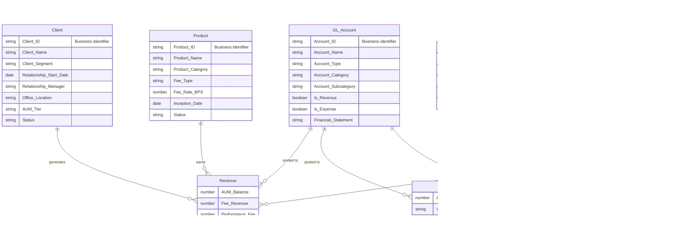

# Logical Data Model — Pinnacle Financial Services Analytics

This model represents the business entities and relationships independent of any technology or platform. It focuses on **what** the data means, not how it is stored.

## Entity Descriptions

| Entity | Description |
|--------|-------------|
| **Client** | Institutional investors and fund holders managed by the firm (pension funds, endowments, trusts) |
| **Product** | Investment products offered by the firm (equity funds, fixed income, alternatives) |
| **GL Account** | General ledger chart of accounts for financial reporting |
| **Department** | Organizational units within the firm |
| **Calendar** | Business calendar with fiscal year alignment |
| **Revenue** | Fee revenue earned from clients on investment products (management fees, performance fees) |
| **Expense** | Operational costs incurred by departments |
| **Budget** | Planned budget allocations by department and GL account |

## Key Business Rules

- A **Client** can generate multiple **Revenue** records across different products, accounts, and time periods
- A **Product** can earn revenue from multiple clients
- **Expenses** and **Budgets** are tracked by **Department** and **GL Account**, not by Client or Product
- **GL Account** classifies entries as either revenue or expense via the `Is_Revenue` / `Is_Expense` flags
- **Budget** supports versioning (`Budget_Version`) and approval tracking
