# Physical Data Model — GB_RAUTHG_DB.ANALYTICS (Snowflake)

This model represents the exact implementation on Snowflake, including data types, constraints, surrogate keys, identity columns, and default values.

```mermaid
erDiagram

    DIM_DATE {
        DATE DATE_KEY PK "NOT NULL"
        NUMBER_4 YEAR "NOT NULL"
        NUMBER_1 QUARTER "NOT NULL"
        VARCHAR_10 QUARTER_NAME "NOT NULL"
        NUMBER_2 MONTH "NOT NULL"
        VARCHAR_9 MONTH_NAME "NOT NULL"
        NUMBER_2 DAY_OF_MONTH "NOT NULL"
        NUMBER_1 DAY_OF_WEEK "NOT NULL"
        VARCHAR_9 DAY_NAME "NOT NULL"
        BOOLEAN IS_BUSINESS_DAY "NOT NULL"
        NUMBER_4 FISCAL_YEAR "NOT NULL"
        NUMBER_1 FISCAL_QUARTER "NOT NULL"
    }

    DIM_CLIENT {
        NUMBER_38 CLIENT_KEY PK "IDENTITY, NOT NULL"
        VARCHAR_20 CLIENT_ID "NOT NULL"
        VARCHAR_100 CLIENT_NAME "NOT NULL"
        VARCHAR_30 CLIENT_SEGMENT "NOT NULL"
        DATE RELATIONSHIP_START "NOT NULL"
        VARCHAR_50 RELATIONSHIP_MANAGER "NOT NULL"
        VARCHAR_30 OFFICE_LOCATION "NOT NULL"
        VARCHAR_20 AUM_TIER "NOT NULL"
        VARCHAR_10 STATUS "NOT NULL, DEFAULT ACTIVE"
    }

    DIM_PRODUCT {
        NUMBER_38 PRODUCT_KEY PK "IDENTITY, NOT NULL"
        VARCHAR_20 PRODUCT_ID "NOT NULL"
        VARCHAR_100 PRODUCT_NAME "NOT NULL"
        VARCHAR_50 PRODUCT_CATEGORY "NOT NULL"
        VARCHAR_30 FEE_TYPE "NOT NULL"
        NUMBER_10_2 FEE_RATE_BPS "NOT NULL"
        DATE INCEPTION_DATE "NOT NULL"
        VARCHAR_10 STATUS "NOT NULL, DEFAULT ACTIVE"
    }

    DIM_GL_ACCOUNT {
        NUMBER_38 GL_ACCOUNT_KEY PK "IDENTITY, NOT NULL"
        VARCHAR_20 GL_ACCOUNT_ID "NOT NULL"
        VARCHAR_100 GL_ACCOUNT_NAME "NOT NULL"
        VARCHAR_20 ACCOUNT_TYPE "NOT NULL"
        VARCHAR_50 ACCOUNT_CATEGORY "NOT NULL"
        VARCHAR_50 ACCOUNT_SUBCATEGORY "NOT NULL"
        BOOLEAN IS_REVENUE "NOT NULL, DEFAULT FALSE"
        BOOLEAN IS_EXPENSE "NOT NULL, DEFAULT FALSE"
        VARCHAR_20 FINANCIAL_STATEMENT "NOT NULL"
    }

    DIM_DEPARTMENT {
        NUMBER_38 DEPARTMENT_KEY PK "IDENTITY, NOT NULL"
        VARCHAR_20 DEPARTMENT_ID "NOT NULL"
        VARCHAR_50 DEPARTMENT_NAME "NOT NULL"
        VARCHAR_20 COST_CENTER "NOT NULL"
        VARCHAR_50 DEPARTMENT_HEAD "NOT NULL"
        VARCHAR_50 PARENT_DEPARTMENT "NULLABLE"
    }

    FACT_REVENUE {
        NUMBER_38 REVENUE_KEY PK "IDENTITY, NOT NULL"
        DATE DATE_KEY FK "NOT NULL"
        NUMBER_38 CLIENT_KEY FK "NOT NULL"
        NUMBER_38 PRODUCT_KEY FK "NOT NULL"
        NUMBER_38 GL_ACCOUNT_KEY FK "NOT NULL"
        NUMBER_18_2 AUM_BALANCE "NOT NULL"
        NUMBER_18_2 FEE_REVENUE "NOT NULL"
        NUMBER_18_2 PERFORMANCE_FEE "NOT NULL, DEFAULT 0"
        NUMBER_18_2 TOTAL_REVENUE "NOT NULL"
        VARCHAR_20 SOURCE_SYSTEM "NOT NULL"
    }

    FACT_EXPENSES {
        NUMBER_38 EXPENSE_KEY PK "IDENTITY, NOT NULL"
        DATE DATE_KEY FK "NOT NULL"
        NUMBER_38 DEPARTMENT_KEY FK "NOT NULL"
        NUMBER_38 GL_ACCOUNT_KEY FK "NOT NULL"
        NUMBER_18_2 ACTUAL_AMOUNT "NOT NULL"
        VARCHAR_100 VENDOR_NAME "NULLABLE"
        VARCHAR_200 EXPENSE_DESCRIPTION "NULLABLE"
        VARCHAR_20 SOURCE_SYSTEM "NOT NULL"
    }

    FACT_BUDGET {
        NUMBER_38 BUDGET_KEY PK "IDENTITY, NOT NULL"
        DATE DATE_KEY FK "NOT NULL"
        NUMBER_38 DEPARTMENT_KEY FK "NOT NULL"
        NUMBER_38 GL_ACCOUNT_KEY FK "NOT NULL"
        NUMBER_18_2 BUDGET_AMOUNT "NOT NULL"
        NUMBER_18_2 FORECAST_AMOUNT "NULLABLE"
        VARCHAR_10 BUDGET_VERSION "NOT NULL, DEFAULT V1"
        VARCHAR_50 APPROVED_BY "NULLABLE"
        DATE APPROVED_DATE "NULLABLE"
    }

    DIM_DATE ||--o{ FACT_REVENUE : "DATE_KEY"
    DIM_CLIENT ||--o{ FACT_REVENUE : "CLIENT_KEY"
    DIM_PRODUCT ||--o{ FACT_REVENUE : "PRODUCT_KEY"
    DIM_GL_ACCOUNT ||--o{ FACT_REVENUE : "GL_ACCOUNT_KEY"

    DIM_DATE ||--o{ FACT_EXPENSES : "DATE_KEY"
    DIM_DEPARTMENT ||--o{ FACT_EXPENSES : "DEPARTMENT_KEY"
    DIM_GL_ACCOUNT ||--o{ FACT_EXPENSES : "GL_ACCOUNT_KEY"

    DIM_DATE ||--o{ FACT_BUDGET : "DATE_KEY"
    DIM_DEPARTMENT ||--o{ FACT_BUDGET : "DEPARTMENT_KEY"
    DIM_GL_ACCOUNT ||--o{ FACT_BUDGET : "GL_ACCOUNT_KEY"
```

## Column Specifications

### DIM_DATE (215 rows)

| Column | Snowflake Type | Nullable | Default | Notes |
|--------|---------------|----------|---------|-------|
| DATE_KEY | DATE | NO | — | Primary key (natural key) |
| YEAR | NUMBER(4,0) | NO | — | Calendar year |
| QUARTER | NUMBER(1,0) | NO | — | Calendar quarter (1-4) |
| QUARTER_NAME | VARCHAR(10) | NO | — | e.g., "Q1 2025" |
| MONTH | NUMBER(2,0) | NO | — | Month number (1-12) |
| MONTH_NAME | VARCHAR(9) | NO | — | e.g., "January" |
| DAY_OF_MONTH | NUMBER(2,0) | NO | — | Day number (1-31) |
| DAY_OF_WEEK | NUMBER(1,0) | NO | — | Day of week (1-7) |
| DAY_NAME | VARCHAR(9) | NO | — | e.g., "Monday" |
| IS_BUSINESS_DAY | BOOLEAN | NO | — | Business day flag |
| FISCAL_YEAR | NUMBER(4,0) | NO | — | Fiscal calendar year |
| FISCAL_QUARTER | NUMBER(1,0) | NO | — | Fiscal quarter (1-4) |

### DIM_CLIENT (12 rows)

| Column | Snowflake Type | Nullable | Default | Notes |
|--------|---------------|----------|---------|-------|
| CLIENT_KEY | NUMBER(38,0) | NO | IDENTITY | Surrogate PK |
| CLIENT_ID | VARCHAR(20) | NO | — | Business key (e.g., C-1001) |
| CLIENT_NAME | VARCHAR(100) | NO | — | |
| CLIENT_SEGMENT | VARCHAR(30) | NO | — | |
| RELATIONSHIP_START | DATE | NO | — | |
| RELATIONSHIP_MANAGER | VARCHAR(50) | NO | — | |
| OFFICE_LOCATION | VARCHAR(30) | NO | — | |
| AUM_TIER | VARCHAR(20) | NO | — | |
| STATUS | VARCHAR(10) | NO | 'ACTIVE' | |

### DIM_PRODUCT (8 rows)

| Column | Snowflake Type | Nullable | Default | Notes |
|--------|---------------|----------|---------|-------|
| PRODUCT_KEY | NUMBER(38,0) | NO | IDENTITY | Surrogate PK |
| PRODUCT_ID | VARCHAR(20) | NO | — | Business key (e.g., EQ-LG) |
| PRODUCT_NAME | VARCHAR(100) | NO | — | |
| PRODUCT_CATEGORY | VARCHAR(50) | NO | — | |
| FEE_TYPE | VARCHAR(30) | NO | — | |
| FEE_RATE_BPS | NUMBER(10,2) | NO | — | Basis points |
| INCEPTION_DATE | DATE | NO | — | |
| STATUS | VARCHAR(10) | NO | 'ACTIVE' | |

### DIM_GL_ACCOUNT (15 rows)

| Column | Snowflake Type | Nullable | Default | Notes |
|--------|---------------|----------|---------|-------|
| GL_ACCOUNT_KEY | NUMBER(38,0) | NO | IDENTITY | Surrogate PK |
| GL_ACCOUNT_ID | VARCHAR(20) | NO | — | Business key (e.g., 4010) |
| GL_ACCOUNT_NAME | VARCHAR(100) | NO | — | |
| ACCOUNT_TYPE | VARCHAR(20) | NO | — | |
| ACCOUNT_CATEGORY | VARCHAR(50) | NO | — | |
| ACCOUNT_SUBCATEGORY | VARCHAR(50) | NO | — | |
| IS_REVENUE | BOOLEAN | NO | FALSE | |
| IS_EXPENSE | BOOLEAN | NO | FALSE | |
| FINANCIAL_STATEMENT | VARCHAR(20) | NO | — | |

### DIM_DEPARTMENT (6 rows)

| Column | Snowflake Type | Nullable | Default | Notes |
|--------|---------------|----------|---------|-------|
| DEPARTMENT_KEY | NUMBER(38,0) | NO | IDENTITY | Surrogate PK |
| DEPARTMENT_ID | VARCHAR(20) | NO | — | Business key (e.g., DEPT-INV) |
| DEPARTMENT_NAME | VARCHAR(50) | NO | — | |
| COST_CENTER | VARCHAR(20) | NO | — | |
| DEPARTMENT_HEAD | VARCHAR(50) | NO | — | |
| PARENT_DEPARTMENT | VARCHAR(50) | YES | — | Self-referencing hierarchy |

### FACT_REVENUE (499 rows)

| Column | Snowflake Type | Nullable | Default | Notes |
|--------|---------------|----------|---------|-------|
| REVENUE_KEY | NUMBER(38,0) | NO | IDENTITY | Surrogate PK |
| DATE_KEY | DATE | NO | — | FK → DIM_DATE |
| CLIENT_KEY | NUMBER(38,0) | NO | — | FK → DIM_CLIENT |
| PRODUCT_KEY | NUMBER(38,0) | NO | — | FK → DIM_PRODUCT |
| GL_ACCOUNT_KEY | NUMBER(38,0) | NO | — | FK → DIM_GL_ACCOUNT |
| AUM_BALANCE | NUMBER(18,2) | NO | — | Assets under management |
| FEE_REVENUE | NUMBER(18,2) | NO | — | Management fee amount |
| PERFORMANCE_FEE | NUMBER(18,2) | NO | 0 | Performance-based fee |
| TOTAL_REVENUE | NUMBER(18,2) | NO | — | FEE_REVENUE + PERFORMANCE_FEE |
| SOURCE_SYSTEM | VARCHAR(20) | NO | — | Originating system |

### FACT_EXPENSES (309 rows)

| Column | Snowflake Type | Nullable | Default | Notes |
|--------|---------------|----------|---------|-------|
| EXPENSE_KEY | NUMBER(38,0) | NO | IDENTITY | Surrogate PK |
| DATE_KEY | DATE | NO | — | FK → DIM_DATE |
| DEPARTMENT_KEY | NUMBER(38,0) | NO | — | FK → DIM_DEPARTMENT |
| GL_ACCOUNT_KEY | NUMBER(38,0) | NO | — | FK → DIM_GL_ACCOUNT |
| ACTUAL_AMOUNT | NUMBER(18,2) | NO | — | Expense amount |
| VENDOR_NAME | VARCHAR(100) | YES | — | External vendor |
| EXPENSE_DESCRIPTION | VARCHAR(200) | YES | — | |
| SOURCE_SYSTEM | VARCHAR(20) | NO | — | Originating system |

### FACT_BUDGET (309 rows)

| Column | Snowflake Type | Nullable | Default | Notes |
|--------|---------------|----------|---------|-------|
| BUDGET_KEY | NUMBER(38,0) | NO | IDENTITY | Surrogate PK |
| DATE_KEY | DATE | NO | — | FK → DIM_DATE |
| DEPARTMENT_KEY | NUMBER(38,0) | NO | — | FK → DIM_DEPARTMENT |
| GL_ACCOUNT_KEY | NUMBER(38,0) | NO | — | FK → DIM_GL_ACCOUNT |
| BUDGET_AMOUNT | NUMBER(18,2) | NO | — | Planned budget |
| FORECAST_AMOUNT | NUMBER(18,2) | YES | — | Revised forecast |
| BUDGET_VERSION | VARCHAR(10) | NO | 'V1' | Version control |
| APPROVED_BY | VARCHAR(50) | YES | — | Approver name |
| APPROVED_DATE | DATE | YES | — | Approval timestamp |

## Key Design Decisions

| Aspect | Implementation |
|--------|---------------|
| **Surrogate Keys** | IDENTITY columns on all dimensions except DIM_DATE (natural key) |
| **Nullability** | Strict NOT NULL on all FK columns; nullable only on optional descriptive attributes |
| **Defaults** | STATUS='ACTIVE' on Client/Product, IS_REVENUE/IS_EXPENSE=FALSE, PERFORMANCE_FEE=0, BUDGET_VERSION='V1' |
| **Grain** | FACT_REVENUE: one row per client × product × GL account × date; FACT_EXPENSES/BUDGET: one row per department × GL account × date |
| **Platform** | Snowflake (no referential integrity enforcement; FK relationships are logical) |
