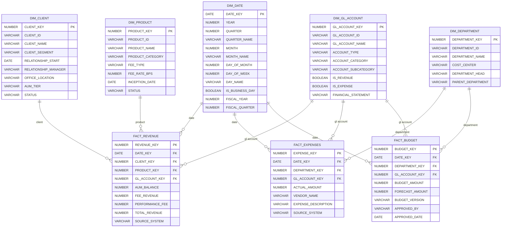

# Star Schema ER Diagram — GB_RAUTHG_DB.ANALYTICS

```mermaid
erDiagram

    DIM_DATE {
        DATE DATE_KEY PK
        NUMBER YEAR
        NUMBER QUARTER
        VARCHAR QUARTER_NAME
        NUMBER MONTH
        VARCHAR MONTH_NAME
        NUMBER DAY_OF_MONTH
        NUMBER DAY_OF_WEEK
        VARCHAR DAY_NAME
        BOOLEAN IS_BUSINESS_DAY
        NUMBER FISCAL_YEAR
        NUMBER FISCAL_QUARTER
    }

    DIM_CLIENT {
        NUMBER CLIENT_KEY PK
        VARCHAR CLIENT_ID
        VARCHAR CLIENT_NAME
        VARCHAR CLIENT_SEGMENT
        DATE RELATIONSHIP_START
        VARCHAR RELATIONSHIP_MANAGER
        VARCHAR OFFICE_LOCATION
        VARCHAR AUM_TIER
        VARCHAR STATUS
    }

    DIM_PRODUCT {
        NUMBER PRODUCT_KEY PK
        VARCHAR PRODUCT_ID
        VARCHAR PRODUCT_NAME
        VARCHAR PRODUCT_CATEGORY
        VARCHAR FEE_TYPE
        NUMBER FEE_RATE_BPS
        DATE INCEPTION_DATE
        VARCHAR STATUS
    }

    DIM_GL_ACCOUNT {
        NUMBER GL_ACCOUNT_KEY PK
        VARCHAR GL_ACCOUNT_ID
        VARCHAR GL_ACCOUNT_NAME
        VARCHAR ACCOUNT_TYPE
        VARCHAR ACCOUNT_CATEGORY
        VARCHAR ACCOUNT_SUBCATEGORY
        BOOLEAN IS_REVENUE
        BOOLEAN IS_EXPENSE
        VARCHAR FINANCIAL_STATEMENT
    }

    DIM_DEPARTMENT {
        NUMBER DEPARTMENT_KEY PK
        VARCHAR DEPARTMENT_ID
        VARCHAR DEPARTMENT_NAME
        VARCHAR COST_CENTER
        VARCHAR DEPARTMENT_HEAD
        VARCHAR PARENT_DEPARTMENT
    }

    FACT_REVENUE {
        NUMBER REVENUE_KEY PK
        DATE DATE_KEY FK
        NUMBER CLIENT_KEY FK
        NUMBER PRODUCT_KEY FK
        NUMBER GL_ACCOUNT_KEY FK
        NUMBER AUM_BALANCE
        NUMBER FEE_REVENUE
        NUMBER PERFORMANCE_FEE
        NUMBER TOTAL_REVENUE
        VARCHAR SOURCE_SYSTEM
    }

    FACT_EXPENSES {
        NUMBER EXPENSE_KEY PK
        DATE DATE_KEY FK
        NUMBER DEPARTMENT_KEY FK
        NUMBER GL_ACCOUNT_KEY FK
        NUMBER ACTUAL_AMOUNT
        VARCHAR VENDOR_NAME
        VARCHAR EXPENSE_DESCRIPTION
        VARCHAR SOURCE_SYSTEM
    }

    FACT_BUDGET {
        NUMBER BUDGET_KEY PK
        DATE DATE_KEY FK
        NUMBER DEPARTMENT_KEY FK
        NUMBER GL_ACCOUNT_KEY FK
        NUMBER BUDGET_AMOUNT
        NUMBER FORECAST_AMOUNT
        VARCHAR BUDGET_VERSION
        VARCHAR APPROVED_BY
        DATE APPROVED_DATE
    }

    DIM_DATE ||--o{ FACT_REVENUE : "date"
    DIM_CLIENT ||--o{ FACT_REVENUE : "client"
    DIM_PRODUCT ||--o{ FACT_REVENUE : "product"
    DIM_GL_ACCOUNT ||--o{ FACT_REVENUE : "gl account"

    DIM_DATE ||--o{ FACT_EXPENSES : "date"
    DIM_DEPARTMENT ||--o{ FACT_EXPENSES : "department"
    DIM_GL_ACCOUNT ||--o{ FACT_EXPENSES : "gl account"

    DIM_DATE ||--o{ FACT_BUDGET : "date"
    DIM_DEPARTMENT ||--o{ FACT_BUDGET : "department"
    DIM_GL_ACCOUNT ||--o{ FACT_BUDGET : "gl account"
```
